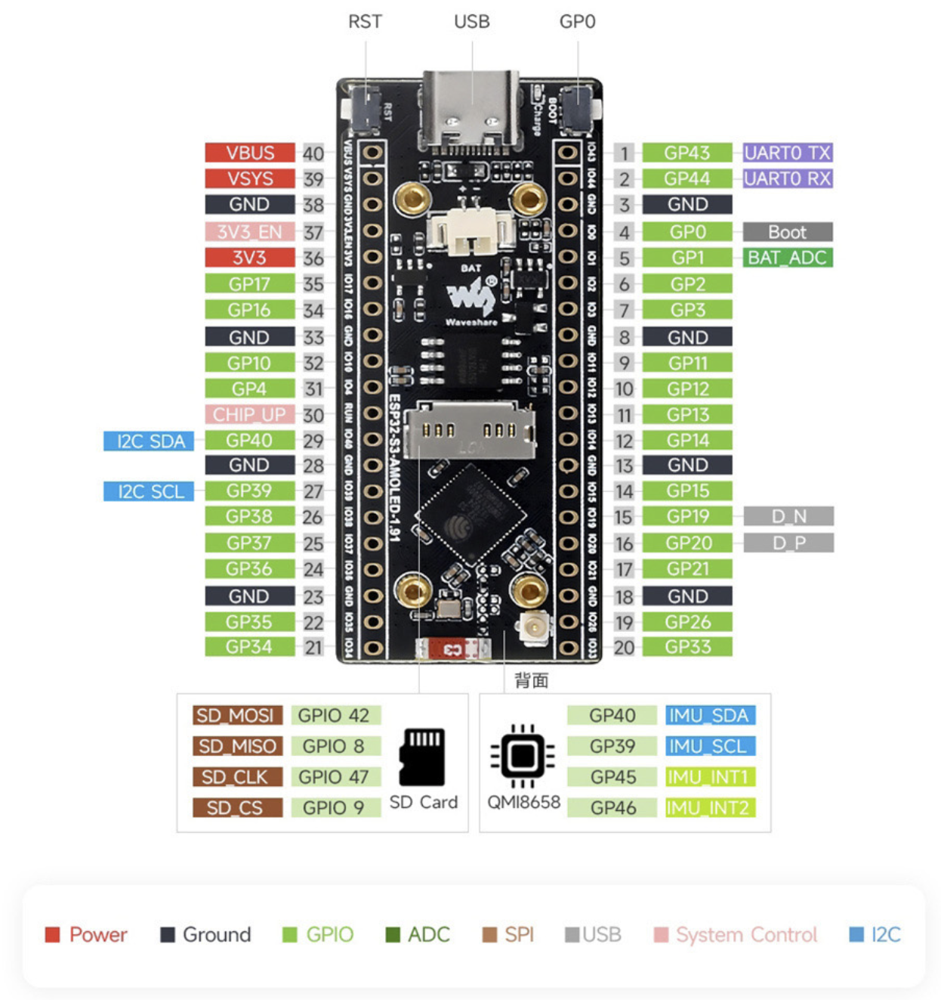

Incidence Perfect NG is a compact 2-axis inclinometer/incidence meter built around an ESP32-S3 + AMOLED touchscreen. It measures **roll** and **pitch** and provides workflows for **ZERO**, **RECAL**, **MODE**, **ROTATE**, and **ALIGN**.

> Beta note: This manual describes the current firmware behavior. If something differs on your device, report the **firmware version shown on the splash screen**.

---

## 1) Getting Started

### Power + Boot

- Connect the device over USB power.
- On boot you'll see the splash screen with the firmware version in the lower-right.
- After boot, the live readout screen appears (roll/pitch).

### What You're Looking At

- **Top status line** shows:
  - orientation mode (`SCREEN UP` or `SCREEN VERTICAL`)
  - axis view (`BOTH`, `ROLL`, `PITCH`)
  - rotation (`ROT 0` or `ROT 180`)
  - live state (`LIVE` or `FROZEN`)
- **Readouts**:
  - `ROLL` (left) and `PITCH` (right) in degrees
  - colors shift for large angles (warning, then critical)
- **Bottom buttons**:
  - `ZERO`, `AXIS`, `MODE`, `ALIGN`, `ROTATE`

---

## 2) Touch Controls (Everyday Use)

### ZERO / RECAL

Use when the tool is resting in the reference position.

- Tap `ZERO`.
- `ZERO` opens a guided workflow:
  - `CONFIRM` to start stillness + averaging
  - `CANCEL` to abort
- During apply, a progress bar is shown.
- On completion, values settle around `0.00`.
- Long-press `ZERO` to start guided `RECAL` (confirm/cancel workflow).

### AXIS

Choose what you want to focus on:

- Tap `AXIS` to cycle: `BOTH -> ROLL -> PITCH -> BOTH`.

### ROTATE (180 degrees)

Use when the device is physically hard to read and you want to flip the UI.

- Tap `ROTATE` to toggle `ROT 0` / `ROT 180`.
- Rotation persists after reboot.

### Freeze / Unfreeze

Use freeze when you want to capture a reading without chasing tiny motion.

- Tap the **readout area** (the roll/pitch values) to toggle `LIVE` / `FROZEN`.
- When frozen, the displayed values hold steady.

---

## 3) ACTION Button (Physical Control)

  
The board has a physical <strong>ACTION button</strong> (electrically <code>GPIO0</code>, labeled <code>BOOT/GPO</code> on the board). It mirrors key actions so you can operate the device when the screen is hard to reach.

  

In normal measurement mode:

- **Short press**: toggle freeze (`LIVE` <-> `FROZEN`)
- **Long press (~1.2s)**: cycle `AXIS` (`BOTH -> ROLL -> PITCH`)
- **Very long press (~2.2s)**: toggle `MODE` (`SCREEN UP` <-> `SCREEN VERTICAL`)
- **Ultra long press (~3.2s)**: start guided `RECAL` workflow

While holding the ACTION button, an on-screen hint shows what will happen on release and a progress indicator for the next threshold.
Countdowns are shown as `X.X s` (with a space before `s`).

In guided `RECAL` workflow:

- **Short press**: `CONFIRM`
- **Long press (~1.2s)**: `CANCEL`

In guided `ZERO` workflow:

- **Short press**: `CONFIRM`
- **Long press (~1.2s)**: `CANCEL`

---

## 4) MODE (Orientation Change)

`MODE` changes how the device interprets orientation.

- `SCREEN UP`: standard "screen facing up" use case
- `SCREEN VERTICAL`: use case where the tool is used on a vertical surface

### Touch Workflow

1. Tap `MODE`.
2. Orientation switches immediately between `SCREEN UP` and `SCREEN VERTICAL`.
3. Mode-specific stored calibration/zero references are loaded automatically.

### Serial / Web

- Serial:
  - `m`: toggle mode
  - `u`: set `SCREEN UP`
  - `v`: set `SCREEN VERTICAL`
- Web:
  - `MODE` toggles immediately

---

## 5) ALIGN (Mechanical Alignment, 6 Steps)

Use `ALIGN` after mounting/enclosing the device to remove systematic bias.

This is a guided, 6-orientation capture procedure. The device will prompt you through the positions and ask you to capture each one.

### Touch Workflow

1. Tap `ALIGN`.
2. Follow the on-screen instruction (example: `Place tool: SCREEN UP`).
3. Tap `CAPTURE` to record that step.
4. Repeat until all steps are captured.
5. Tap `CANCEL` to abort safely at any time.
6. After step 6, ALIGN completes immediately and returns to normal operation.

Important:

- ALIGN and RECAL are separate operations.
- ALIGN does **not** run RECAL automatically.
- Run guided `RECAL` separately in the active `MODE` when needed.
- If you use both `SCREEN UP` and `SCREEN VERTICAL`, run `RECAL` in each mode so both mode-specific references are updated.

### ACTION Button in ALIGN Workflow

If the screen is hard to access (for example screen-down steps):

- ACTION button short press = `CAPTURE`

---

## 6) Serial Control (Optional)

If connected to a PC, you can control the same workflows via serial (115200).

Core commands:

- `z`: start guided ZERO workflow
- `a`: AXIS cycle (`BOTH -> ROLL -> PITCH`)
- `r`: ROTATE 180 toggle
- `C`: start ALIGN workflow
- `k`: start guided RECAL workflow
- `c`: context action
  - in ALIGN: `CAPTURE`
  - in ZERO pending: `CONFIRM`
  - in RECAL pending: `CONFIRM`
  - otherwise: start+confirm guided RECAL
- `m`: toggle mode immediately
- `u`: set `SCREEN UP` immediately
- `v`: set `SCREEN VERTICAL` immediately
- `x`: cancel pending ZERO / RECAL / ALIGN
- `d`: toggle raw IMU debug stream (5 Hz)

Serial and touch workflows are designed to stay synchronized.

---

## 7) Troubleshooting

### Touch Feels Hard To Trigger

- Use ACTION button alternatives for critical actions.
- Try deliberate taps (not swipes) centered on the button.

### Serial Monitor Doesn't Resume After Reset

- Some setups require closing/reopening the serial monitor after reset.
- Always report the firmware version shown on splash if you see inconsistent serial behavior.

### MODE Doesn't Apply

- MODE is immediate in current firmware.
- If orientation does not change, verify command source:
  - touch `MODE`,
  - serial `m/u/v`,
  - ACTION very-long press.

---

## 8) Beta Tester Checklist + Feedback

If you're testing externally, use:

- `../release/beta-checklist.md`
- `../release/tester-handoff-note.md`

When reporting an issue, include:

1. Firmware version (from splash)
2. Exact steps to reproduce
3. Expected vs actual result
4. Photos/video if UI-related

---

## Appendix A: Hardware Notes

For reference bring-up settings (Arduino IDE), see:

- `../hardware/board-settings.md`
- `../hardware/board-settings-arduino-ide.jpg`

---

## Authorship

This firmware and UI were developed by **Per Takman**, with assistance from **OpenAI Codex (Codex CLI)**.

---

## License And Warranty

- The project source code is released under the MIT License.
- The software is provided "AS IS", without warranty of any kind.
- Third-party manuals, schematics, and library dependencies remain under their respective original licenses/terms.

